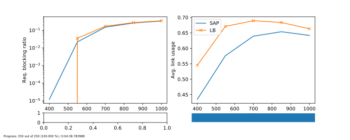

# Simple Opaque WDM Simulation

Simple simulator implemented in Python 3.7 for simulating opaque WDM networks, i.e.g, optical networks containing wavelength conversion at each noce.
The simulator offers multi-threading for running multiple configurations using a pool of threads.
Graph manipulation is implemented using the NetworkX 2.x library. 

### Dependencies:

This code was validated using Python 3.7. The software has the following dependencies:

- Numpy
- NetworkX
- Matplotlib

### Running the simulator

At the correct Python environment (with the dependencies installed), run:

`python run.py`

to launch the simulator with the standard configuration. At the end, you will have the following plot within the folder `results/data`:

The `run.py` has a help function to assist you making particular configurations. Launch

`python run.py --help`

to access it.

### Citing this software

BibTeX entry:

~~~~
@ARTICLE{Natalino:2016:jocn,
author={C. N. {da Silva} and L. {Wosinska} and S. {Spadaro} and J. C. W. A. {Costa} and C. R. L. {Frances} and P. {Monti}},
journal={IEEE/OSA Journal of Optical Communications and Networking},
title={Restoration in optical cloud networks with relocation and services differentiation},
year={2016},
volume={8},
number={2},
pages={100-111},
doi={10.1364/JOCN.8.000100},
ISSN={1943-0620},
month={Feb},}
~~~~
