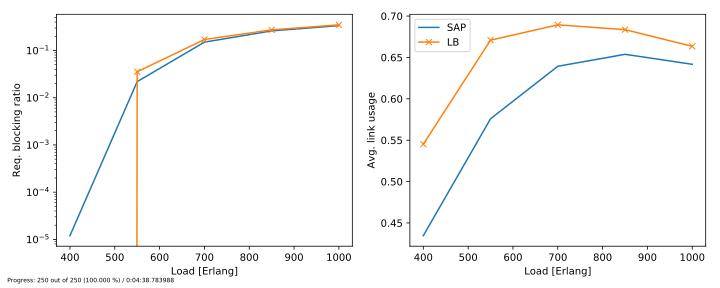

# Simple Opaque WDM Simulator

Simple simulator implemented in Python 3.7 for simulating opaque WDM networks, e.g, optical networks containing wavelength conversion at each noce.
This means that the lightpaths do not need to enforce the wavelength continuity constraint.
For more info, see [this paper](https://ieeexplore.ieee.org/abstract/document/767791).
The simulator implements the basic funcionalities, and allows you to add more complex features for your particular purposes.
The simulator offers multi-threading for running multiple configurations using a pool of threads.
Graph manipulation is implemented using the NetworkX 2.x library.

<p align="center">
  
</p>

### Dependencies:

This code was validated using Python 3.7. The software has the following dependencies:

- [Numpy](https://numpy.org/)
- [NetworkX](https://networkx.github.io/)
- [Matplotlib](https://matplotlib.org/)
- [GitPython](https://gitpython.readthedocs.io/en/stable/)

### Code organization and features:

The following algorithms are implemented:
- **Shortest available path (SAP)**: selects the shortest available out of *k* paths.
- **Load balancing (LB)**: selects the path with the lowest load, i.e., the path with the lowest maximum link load.

The following files are available:

- [core](./core.py): File containing the main classes composing the simulation.
    - *Environment*: This class models a particular instance of the simulation scenario, including simulation queue, clock and statistics gathering.
    - *Service*: This class models the service request, which later becomes a connection if accomodated in the network.
    - *Event*: This class models an event to be added to the simulator's event queue.
    - ```run_simulation(env: Environment)```: function that executes the simulation loop for a particular environment instance.
- [events](./events.py): File containing the events that can happen during the simulation.
    - ```arrival(env: Environment, service: Service)```: function that is called when a new service request arrives.
    - ```departure(env: Environment, service: Service)```: function that is called when the resources associated with a service should be released, i.e., the service has reached its holding time.
- [graph](./graph.py): File containing helper functions that read topologies from [SNDlib](http://sndlib.zib.de/) format and converts it into NetworkX graphs. Also has some helper functions for path computation.
- [plots](./plots.py): File containing helper functions to plot the simulation progress and the final results.
- [policies](./policies.py): File containing the routing algorithms to be used by the simulator.
    - *RoutingPolicy*: Abstract class to be inherited by any algorithm implemented, containing the method *route()*.
    - *ShortestAvaiablePath*: Selects the route that has the shortest among the list of *k* shortest paths.
    - *LoadBalancing*: Selects the route that has the lowest resources usage at the most loaded link.
- [run](./run.py): File containing the main script of the simulation. Run `python run.py --help` to get a list of arguments that can be passed.
- [notebook](reading-results.ipynb): File containing a Jupyter notebook where the final binary results file is read and results are plotted. Also show how to plot topologies using the NetworkX module.

### Running the simulator

At the correct Python environment (with the dependencies installed), run:

`python run.py`

to launch the simulator with the standard configuration. At the end, you will have the following plot within the folder `results/data`:



The `run.py` has a help function to assist you making particular configurations. Launch

`python run.py --help`

to access it.

### Post-processing the results

The code <a href='./reading-results.ipynb'>in this notebook</a> shows how to read the data saved from a simulation run and plot the results.

### Citing this software

This software was developed as part of the following research paper:

C. N. da Silva, L. Wosinska, S. Spadaro, J. C. W. A. Costa, C. R. L. Frances and P. Monti, "Restoration in optical cloud networks with relocation and services differentiation," in IEEE/OSA Journal of Optical Communications and Networking, vol. 8, no. 2, pp. 100-111, Feb. 2016. DOI: 10.1364/JOCN.8.000100. [Open access](http://www.diva-portal.org/smash/record.jsf?pid=diva2%3A925332&dswid=-6552)

BibTeX entry:

~~~~
@ARTICLE{Natalino:2016:jocn,
    author={C. N. {da Silva} and L. {Wosinska} and S. {Spadaro} and J. C. W. A. {Costa} and C. R. L. {Frances} and P. {Monti}},
    journal={IEEE/OSA Journal of Optical Communications and Networking},
    title={Restoration in optical cloud networks with relocation and services differentiation},
    year={2016},
    volume={8},
    number={2},
    pages={100-111},
    doi={10.1364/JOCN.8.000100},
    ISSN={1943-0620},
    month={Feb},
    }
~~~~
